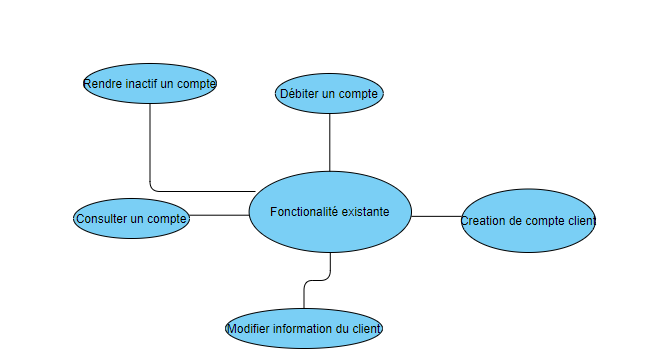
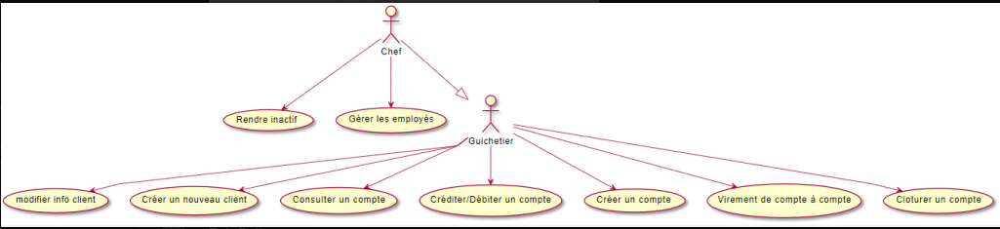

[.text-center]
= Cahier Des Charges 

== Version 3
01/05/2022

[.text-right]

==== _eleves groupe 2A3 :_ +
_Hu Shiyu +
Babel Teddy +
Sekoub Walaedine +
Prochaska Oryann_

[.text-center]
==== SAE Bank S2 05 +
Analyse besoins entreprise +
Dossier de gestion de projet +
Etude economique

<<<

== SOMMAIRE 
. Présentation générale +
. Fonctionnalités déjà présentes  +
. Fonctionnalités à developper +
. Use Case Diagram +
. Analyse de l'existant +
. Les Contraintes +

<<<

=== Présentation Générale
====
Notre client est la banque _DailyBank_ qui souhaite remplacer plusieurs outils obsolètes de gestion des comptes clients de la banque. +
Notre travail sera donc d'adapter l'application déjà existante à ses nouveaux besoins. +
Cette application est destinée aux guichetiers.

====

=== Fonctionnalités déjà présentes ===
* Creation client 
* Modifier informations d'un client
* Consulter un compte
* Debiter un compte 
* Rendre inactif un compte +
_Disponible uniquement pour le guichetier_ +
_Seul le chef de l'agence peut rendre un compte inactif_

===== Schéma des fonctionalite présente

=== Fonctionnalités à developper
====
Guichetier : Lui permettre de crediter ou debiter un compte client ou créer de nouveaux clients, faire les opétations courante, effectuer un virement de compte à compte et cloturer si besoin. +
Chef d'agence : Lui permettre de gerer les employes et les opérations exeptionnelles.
====

===== Use Case Diagram de la solution
 

=== Les Contraintes et modalités d'organisation
* Develloper à partir d'une base de donnée fournit
* L’appli initiale sera fournie en java avec une IHM codée en java FX
* Depot à effectuer sous GitHub
* Participation de tous
* Garder à jour la documentation du code +

Pour le Gant,aller voir le Gant.pdf pour une meilleur lisibilité.

=== Modalités d’organisation pour la suite du projet
- 22/05 Livraison de la premiere version du jar avec les fonctionnalite principale et des autres livrables
- 05/06 Livraison de la version ameliorer, corriger du jar et des autres livrables
- 12/06 Livraison de la version finale du jar et des autres livrables

