[.text-center]
= Documentation utilisateur

== Version 2
08/06/2022

[.text-right]

==== _eleves groupe 2A3 :_ +
_Prochaska Oryann +
Babel Teddy +
Sekoub Walaedine +
Hu Shiyu_

[.text-center]
==== SAE Bank S2 05 +
Analyse besoins entreprise +
Dossier de gestion de projet +
Etude economique

<<<

== SOMMAIRE 
. Présentation générale +
. Installation utilisation +
. Fonctionnement +
. Resultat produit avec jeu d'essai commenté 

<<<

=== Présentation Générale
====
Bienvenue sur l'application _DailyBank_ v1, une version amélioré. +
Dans cette nouvelle version nous y avons inclus plusieurs nouvelles fonctionnalités à savoir : +

_Pour le guichetier :_ +
#Générer# un relevé mensuel d’un compte en PDF +
#Gérer# les prélèvements automatiques +
#Créditer# un compte client +
#Effectuer# un Débit exceptionnel

_Pour le chef d'agence :_ +
#Effectuer# un Débit exceptionnel +
#Simuler# un emprunt +
#Simuler# une assurance d’emprunt

====

=== Installation et utilisation
* Execution avec un double clic sur le fichier avec l'extension .jar ou bien après une extraction du fichier compressé. +
* Une connexion à un compte chef d'agence est nécessaire pour modifier les employés et autres chefs d'agences. +
* Sur les pages de type "management"des clients ou employés veuillez rechercher puis cliquer sur le nom d'une personne pour voir auxquelles fonctionnalités elle a accès.

===== Schéma des fonctionalite présente
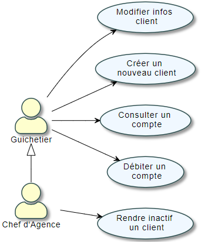

== Fonctions pour le Guichetier

=== Crediter/Debiter
* Après s'être connecté, cliquer sur #'Gestion'# et selectionner #Clients#. +
* Renseigner les informations du client et cliquer sur #'Rechercher'#. +
* Selectionner le client et cliquer sur Comptes client. +
* Selectionner un compte et cliquer sur Voir operation afin d'enregister un credit ou un debit. +

=== Créer un Compte
* Apres s'être connecté, cliquer sur #'Gestion'# et selectionner #'Clients'#. +
* Renseigner les informations du client et cliquer sur #'Rechercher'#. +
* Selectionner le client et cliquer sur #'Compte client'#. +
* Cliquer ensuite sur #'Nouveau compte'#. +
* Renseigner le montant du decouvert autorisé, ainsi que le solde de debut(doit êtres superieur ou égal a 50). +

=== Clôturer un Compte
* Après s'être connecté, cliquer sur #'Gestion'# et selectionner #'Client'#. +
* Renseigner les information du client et cliquer sur rechercher. +
* Selectionner le client et cliquer sur Comptes client. +
* Selectionner ensuite un compte. +
* Cliquer sur Cloturer compte. +
* Puis valider la cloturation du compte. +

=== Virement Compte à Compte
* Apres s'être connecté, cliquer sur #'Gestion'#
* sélectionner un client, son compte
* Cliquer sur #'Virement'# et choisir le montant puis le compte visé

=== Générer un relevé mensuel
* Apres s'être connecté, cliquer sur #'Gestion'# et selectionner #'Clients'#. +
* Renseigner les informations du client et cliquer sur #'Rechercher'#. +
* Selectionner le client puis cliquer sur #'Relevé mensuel'#.

=== Gérer les prélèvements automatiques
* Apres s'être connecté, cliquer sur #'Gestion'#
* sélectionner un client, son compte
* Cliquer sur #'Prélèvement'# 
* Pour chacun il est possible de l'effacer, le modifier ou en ajouter un nouveau.

== Fonctions pour le Chef d'agence

=== Desactiver un client
* Après s'être connecté, cliquer sur gestion et selectionner #'Client'#. +
* Renseigner les informations du client et cliquer sur #'Rechercher'#. +
* Sélectionner le client et cliquer sur #'Desactiver client'#. +

=== Simuler un emprunt et simuler une assurance d’emprunt
* Après s'être connecté, cliquer sur gestion et selectionner #'Simulation'#
* Deux choix s'offrent à vous soit simulation emprunt soit simulation assurance emprunt
* Pour les deux vous devez remplir les cases indiquées et après a validation vous obtiendrez le résultat sur la partie gauche de la fenêtre.

===== Use Case Diagram
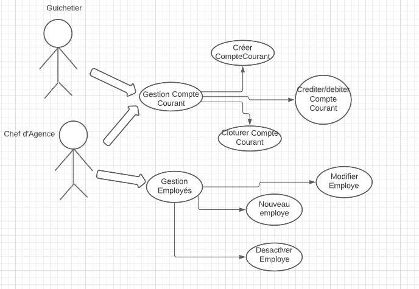

=== Resultat produit avec jeu d'essai commenté
 ---
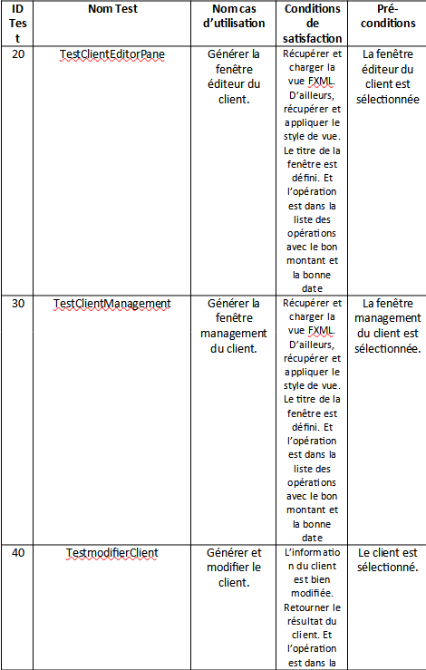
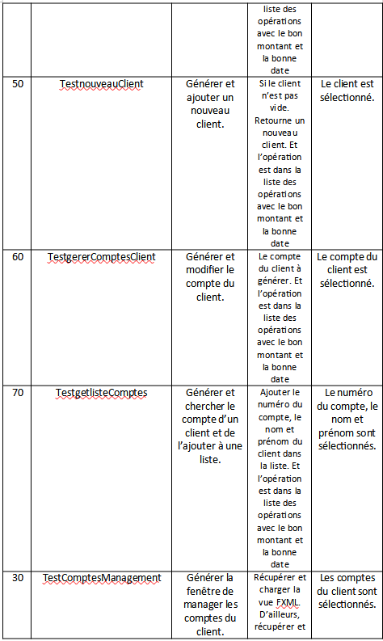
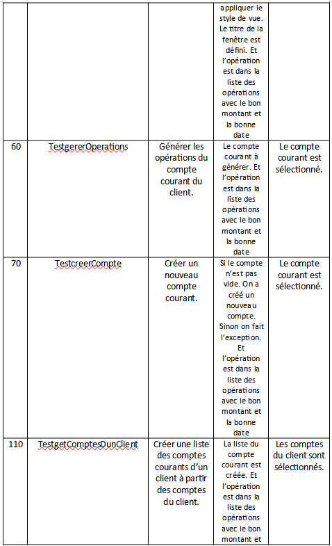
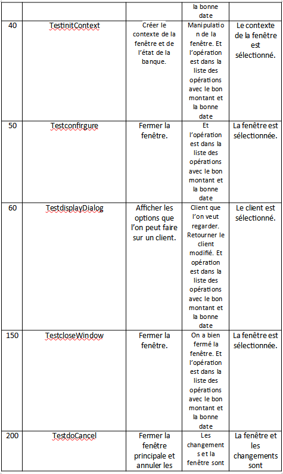
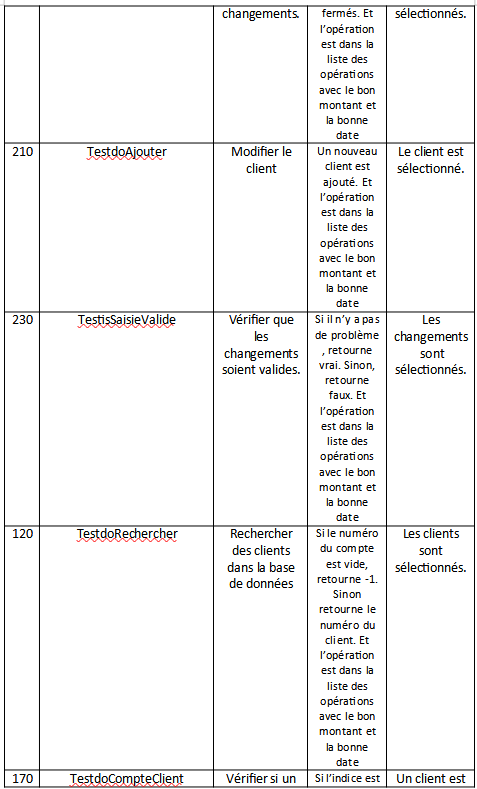
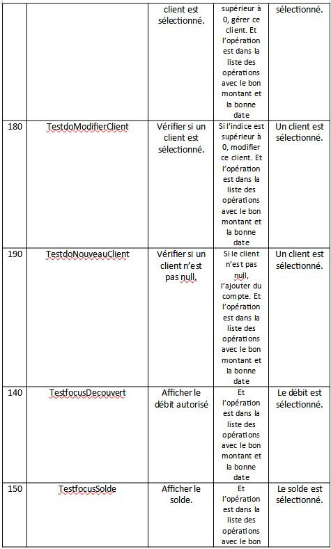
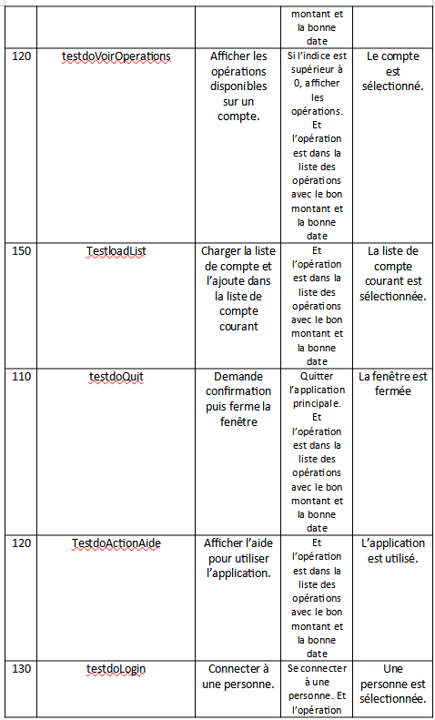
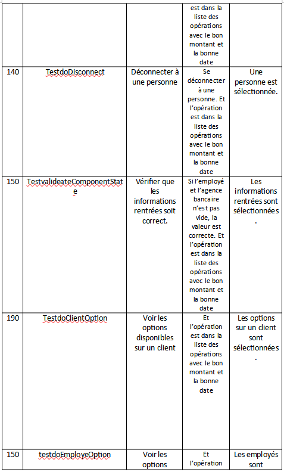
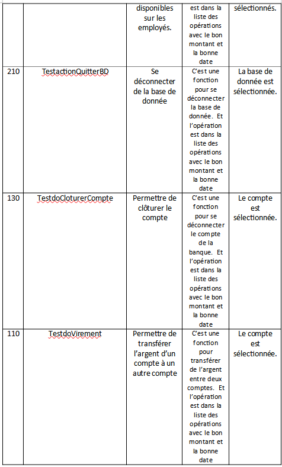
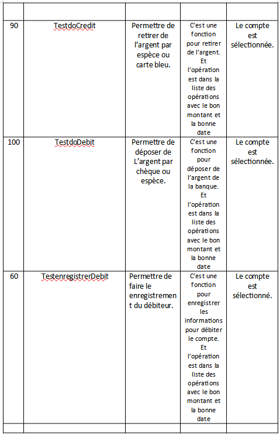
 ---

