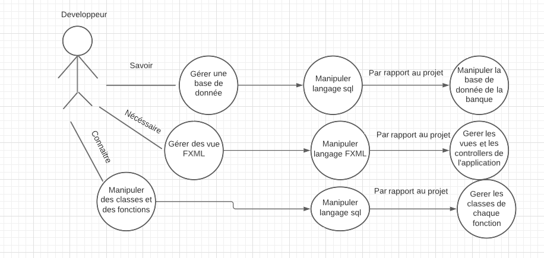
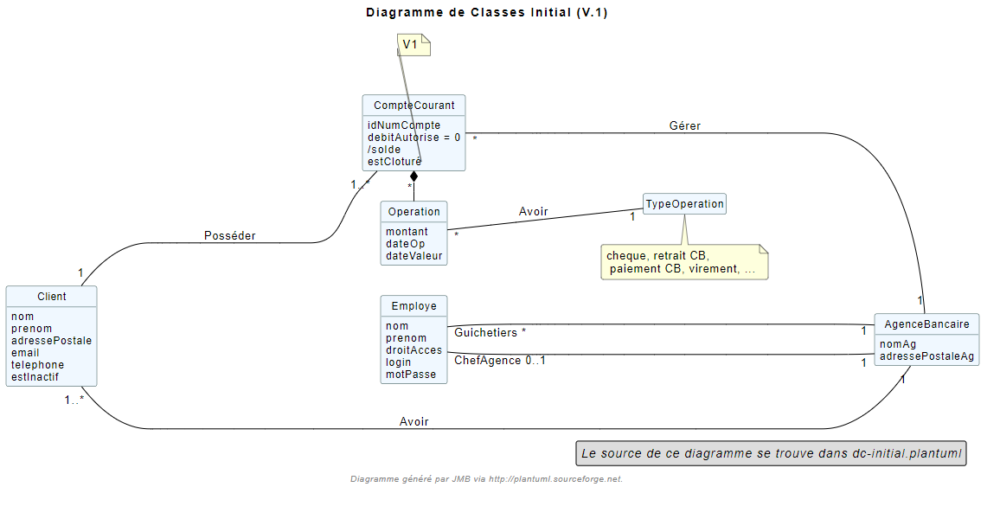

[.text-center]
= Documentation technique

== Version 1
30/05/2022

[.text-right]

==== _eleves groupe 2A3 :_ +
_Prochaska Oryann +
Babel Teddy +
Sekoub Walaedine +
Hu Shiyu_

[.text-center]
==== SAE Bank S2 05 +
Analyse besoins entreprise +
Dossier de gestion de projet +
Etude economique

<<<

== SOMMAIRE 
. Présentation application +
. Architecture +
. Présentation et explication de tous les diagrammes : +
.. Partie du use case mis en oeuvre 
.. Diagramme de classse associé
. Elements de code significatifs commentés

<<<

=== Présentation Application

====
image::USC.PNG[]
Le guichetier a pour mission de gérer les comptes courants du client ainsi que c'est information. +
Le chef d'agence a les mêmes missions que le guichetier,cependant il doit aussi gérer les employées et il est le seul a pouvoir suprimer un compte client. +

====

=== Architecture
====
Diagramme Séquence : +

====

====
Bienvenue sur l'application _DailyBank_ v1,
cette application est structuré avec différents packages contenant :  

.. La classe de #lancement application# +
.. Les classes #contrôles# +
... Décrit les fonctions utilisées dans les fenêtres (ex : boutons)
.. Les classes #outils# +
... Permet de détailler les classes objets
.. Les classes #objet# +
... Définit les types utilisés dans l'application
.. Les classes #vues# +
... Définissent les fenêtres en FXML et contiennent leur controleur
.. Les classes #exception# +
... Définissent les exceptions propres à l'application

=== Présentation et explication de tous les diagrammes
====   Partie du use case mis en oeuvre
====
image::partie01_v1_usecase.png[]
Le chef d'agence peut à présent gérer les employés grâce à une fenêtre similaire à celle de gestion des clients. +

image::partie2_v1_usecase.png[]
Le guichetier peut maintenant créditer/débiter, créer un compte client, faire un virement de compte à compte ou clôturer un compte.
====

==== Diagramme de classse associé
====

Les employés et les chefs d'agence travaillent dans une agence bancaire, il ne peut y avoir qu'un chef par agence et autant d'employés que nécessaire. Une agence bancaire a minimum 1 client. Un client peuvent avoir plusieurs comptes courants sur lesquels peuvent être effectués des opérations qui possèdent à chaque fois un type.
====

=== Elements de code significatifs commentés. +
=== Permet de crée un Compte Courant(Fonction mis en place par Walaedine Sekoub) +

----
	//Crée un nouveau Compte. +
	public CompteCourant creerCompte() {
		CompteCourant compte;
		CompteEditorPane cep = new CompteEditorPane(this.primaryStage, this.dbs);
		compte = cep.doCompteEditorDialog(this.clientDesComptes, null, EditionMode.CREATION);
		if (compte != null) {
			try {
				AccessCompteCourant ac= new AccessCompteCourant();
				ac.insertNewCompteCourant(compte.debitAutorise, compte.solde, this.clientDesComptes.idNumCli);
				
				// TODO : enregistrement du nouveau compte en BDD (la BDD donne de nouvel id
				// dans "compte")

				// if JAMAIS vrai
				// existe pour compiler les catchs dessous
				if (Math.random() < -1) {
					throw new ApplicationException(Table.CompteCourant, Order.INSERT, "todo : test exceptions", null);
				}
			} catch (DatabaseConnexionException e) {
				ExceptionDialog ed = new ExceptionDialog(this.primaryStage, this.dbs, e);
				ed.doExceptionDialog();
				this.primaryStage.close();
				compte=null;
			} catch (ApplicationException ae) {
				ExceptionDialog ed = new ExceptionDialog(this.primaryStage, this.dbs, ae);
				ed.doExceptionDialog();
				compte=null;
			}
		}
		return compte;
	}
 
//enregistremment du nouveau compte dans la base de donnée
	public void insertNewCompteCourant(double debitAutorise, double montant,int idNumClient)
			throws DatabaseConnexionException, ManagementRuleViolation, DataAccessException {
		try {
			Connection con = LogToDatabase.getConnexion();
			CallableStatement call;

			String q = "{call CreerCompte (?, ?, ?, ?)}";
			// les ? correspondent aux paramètres : cf. déf procédure (4 paramètres)
			call = con.prepareCall(q);
			// Paramètres in
			call.setDouble(1, debitAutorise);
			// 1 -> valeur du premier paramètre, cf. déf procédure
			call.setDouble(2, montant);
			call.setInt(3, idNumClient);
			// Paramètres out
			call.registerOutParameter(4, java.sql.Types.INTEGER);
			// 4 type du quatrième paramètre qui est déclaré en OUT, cf. déf procédure

			call.execute();

			int res = call.getInt(4);

			if (res < 0) { // Erreur applicative
				throw new ManagementRuleViolation(Table.CompteCourant, Order.INSERT,
						"Erreur de règle de gestion : Montant initiale trop petite ", null);
			}
		} catch (SQLException e) {
			throw new DataAccessException(Table.CompteCourant, Order.INSERT, "Erreur accès", e);
		}
	}
	
	

----

 
 

