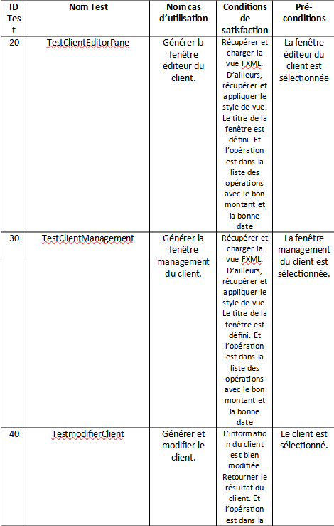
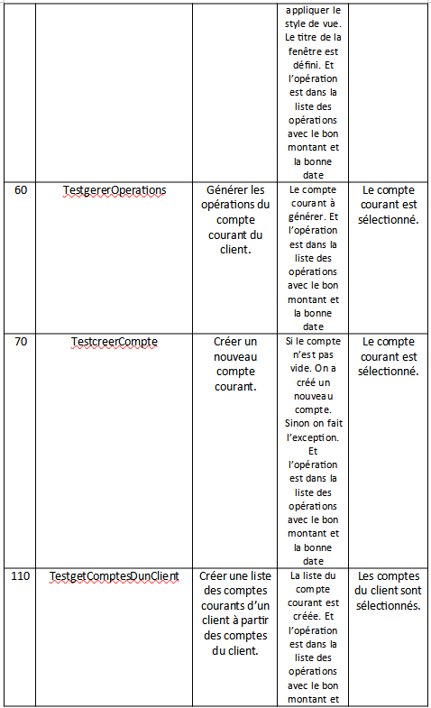
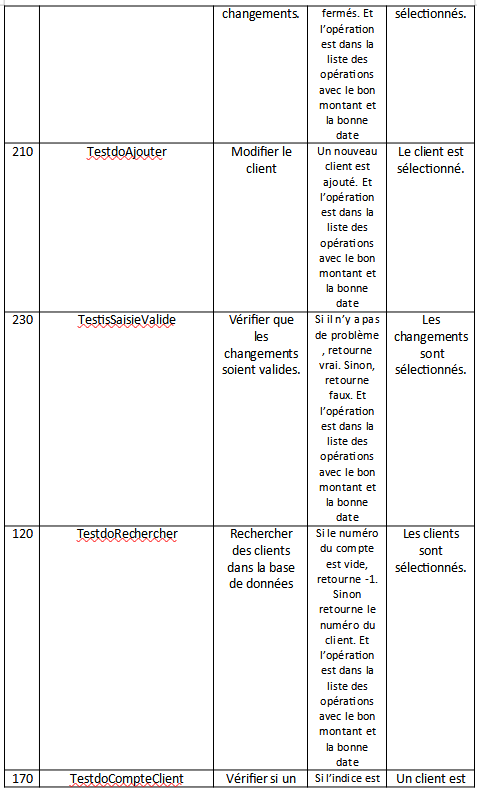
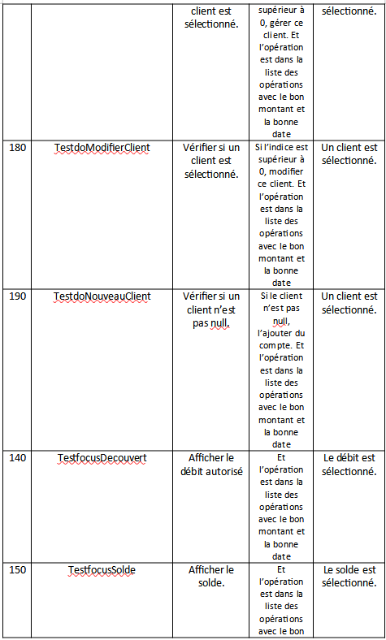
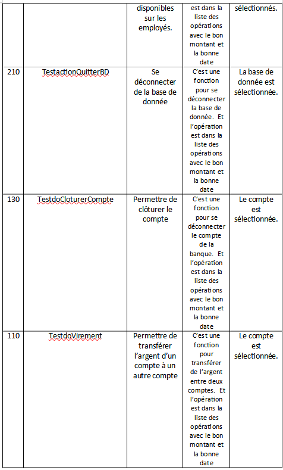
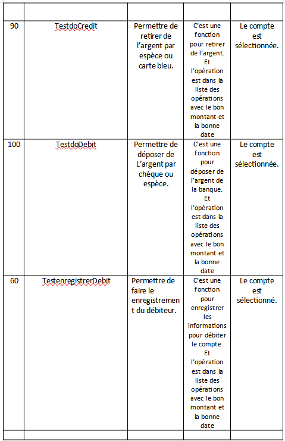

[.text-center]
= Documentation technique

== Version 2
08/06/2022

[.text-right]

==== _eleves groupe 2A3 :_ +
_Prochaska Oryann +
Babel Teddy +
Sekoub Walaedine +
Hu Shiyu_

[.text-center]
==== SAE Bank S2 05 +
Analyse besoins entreprise +
Dossier de gestion de projet +
Etude economique

<<<

== SOMMAIRE 
. Présentation générale, rôle de l'application +
. Installation utilisation +
. Fonctionnement +
. Résultats produits avec jeux d'essai commentés

<<<

=== Présentation générale, rôle de l'application

====
image::USC.PNG[]
Bienvenue sur l'application _DailyBank_ v1, une version amélioré. +
Dans cette nouvelle version nous y avons inclus plusieurs nouvelles fonctionnalités à savoir : +

#Générer# un relevé mensuel d'un compte en PDF +
#Gérer# les prélèvements automatiques +
#Effectuer# un Débit exceptionnel +
#Simuler# un emprunt +
#Simuler# une assurance d'emprunt +

Cette application est néanmoins toujours destinée aux guichetiers ainsi qu'aux chefs d'agences.

====

=== Installation et utilisation
====
* Execution avec un double clic sur le fichier avec l'extension .jar ou bien après une extraction du fichier compressé. +
* Une connexion à un compte chef d'agence est nécessaire pour simuler un emprunt et une assurance d'emprunt. +
* Un guichetier peut générer un relevé mensuel d'un compte et gérer les prélèvements automatiques. +

#_Seul le chef de l'agence peut rendre un compte inactif_#

====

=== Fonctionnement
====   Partie du use case mis en oeuvre
====
#Fonctionnement pour le Guichetier#

#Fonctionnement pour le Chef d'Agence#

====

=== Résultats produits avec jeux d'essai commentés +
====

image::fiche_test_v2_2.png[]

image::fiche_test_v2_4.png[]

image::fiche_test_v2_7.png[]
image::fiche_test_v2_8.png[]

 
 

